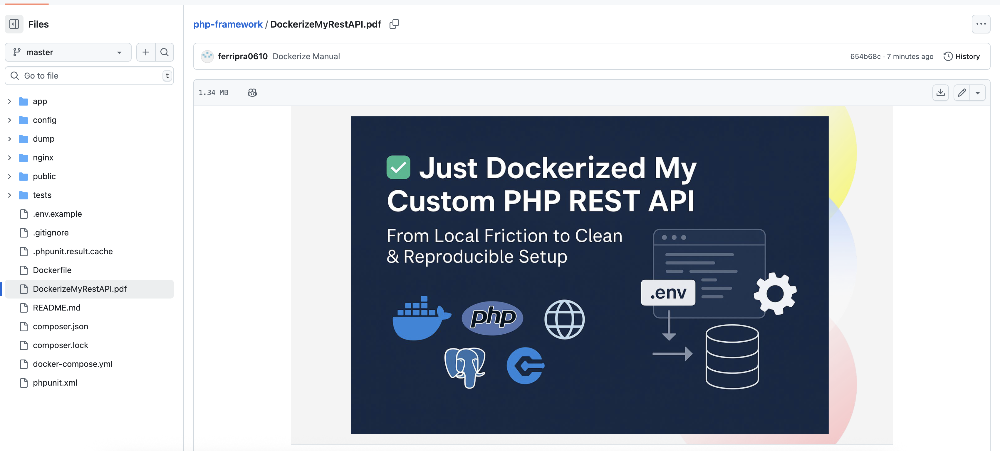

# How To Run

- Open Terminal
- Clone Project
- Go to the root directory
- composer install
- composer dump-autoload if necessary
- setup and prepare database, config database configuration file app/Core/Database.php
- php -S localhost:8000 -t public  

# How To Run In Docker

- Open Terminal
- Clone Project
- Go to the root directory
- Read DockerizeMyRestAPI.pdf

- Good Luck !
